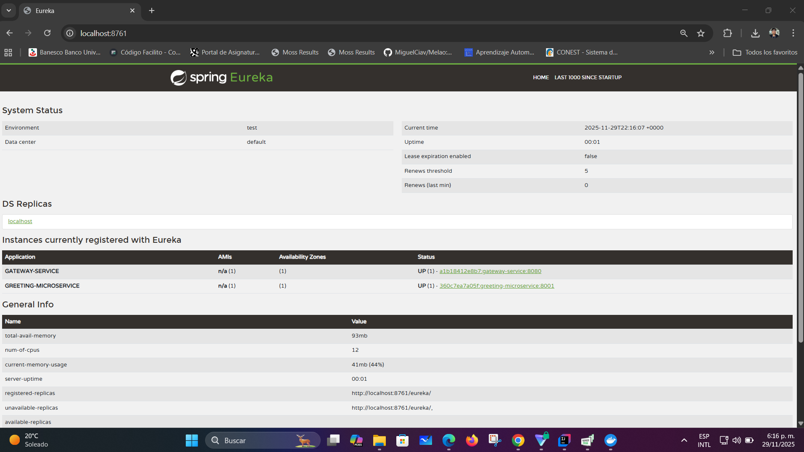
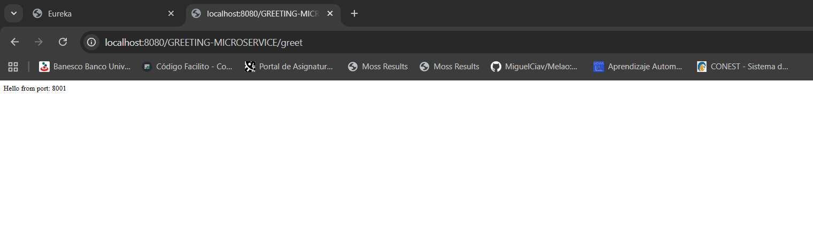
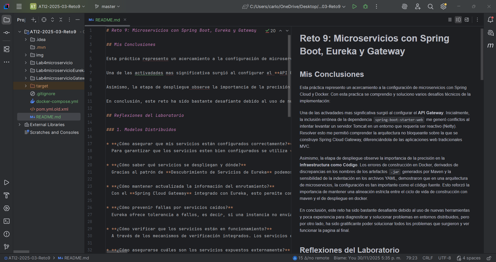

# Reto 9: Microservicios con Spring Boot, Eureka y Gateway

## Mis Conclusiones

Esta práctica represento un acercamiento a la configuración de microservicios con Spring Cloud y Docker. Con esta practica se comprendio y soluciono varios desafíos técnicos de la implementación:

Una de las activadades mas significativa surgió al configurar el **API Gateway**. Inicialmente, la inclusión errónea de la dependencia `spring-boot-starter-webmvc` me generó conflictos al intentar levantar un servidor Tomcat en un entorno que requería ser reactivo (Netty), entonces lo tuve que cambiar por `spring-boot-starter-web`. Resolver esto me permitió comprender la arquitectura no bloqueante sobre la que se construye Spring Cloud Gateway, diferenciándola de las aplicaciones web tradicionales MVC.

Asimismo, la etapa de despliegue observe la importancia de la precisión en la **Infraestructura como Código**. Los errores de construcción en Docker, derivados de discrepancias en los nombres de los artefactos `.jar` generados por Maven y la sensibilidad de la indentación en los archivos YAML, demostraron que en una arquitectura de microservicios, la configuración es tan importante como el código fuente. Esto reforzó la importancia de mantener una alineación estricta entre el ciclo de vida de construcción con maven y el de despliegue en docker.

En conclusión, este reto ha sido bastante desafiante debido al uso de nuevas herramientas y poca experiencia para diagnosticar y solucionar problemas en entornos distribuidos, pero por otro lado, ha sido gratificante poder solucionar todos los problemas que surgieron y ver funcionar la pagina al final. 

## Reflexiones del Laboratorio

### 1. Modelos Distribuidos

* **¿Cómo asegurar que mis servicios están configurados correctamente?**
  Para garantizar que los servicios esten bien configurados se utiliza **Spring Cloud Config** para la gestión centralizada de la configuración en un repositorio Git, asegurando consistencia en todos los nodos.

* **¿Cómo saber qué servicios se despliegan y dónde?**
  Gracias al patrón de **Descubrimiento de Servicios de Eureka** podemos registrar de forma automatica en el servidor Eureka al iniciar, esto permite su localización dinámica sin configurar IPs estáticas.

* **¿Cómo mantener actualizada la información del enrutamiento?**
  Con el **Spring Cloud Gateway** integrado con Eureka, esto permite consultar el registro de servicios para enrutar las peticiones dinámicamente a las instancias disponibles.

* **¿Cómo prevenir fallas por servicios caídos?**
  Eureka ofrece tolerancia a fallos, es decir, si una instancia no envía un señal de vida, se marca como inactiva y se deja de enviar tráfico a ella. 

* **¿Cómo verificar que los servicios están en funcionamiento?**
  A través de los mecanismos de verificación integrados. Los servicios envían señales de manera activa a Eureka para confirmar que están vivos. También se usa **Spring Boot Actuator** para el monitoreo y  las métricas.

* **¿Cómo asegurarse cuáles son los servicios expuestos externamente?**
  Implementando el patrón **API Gateway**. Este actúa como la única puerta de enlace pública, mientras que los microservicios reales se mantienen en una red privada (como la red `dockernetflix-network` que creamos), inaccesibles directamente desde el exterior.

### 2. Maven vs. Gradle
**¿Qué diferencia existe entre un proyecto creado con Maven y con Gradle en su estructura?**
Ambos siguen la convención de directorios de Java (`src/main/java`), pero por un lado, maven es más estricto en su "ciclo de vida" y estructura de proyecto definida por el estándar, haciendo que la diferencia más visible es el archivo descriptor, donde maven usa `pom.xml` en la raíz, mientras que Gradle usa `build.gradle` junto con sus respectivos wrappers. 

**¿Qué caracteriza la definición de dependencias en un pom.xml vs build.gradle?**
* **Maven (`pom.xml`):** Utiliza **XML**, un lenguaje de marcado que es muy estructurado y verboso. Cada dependencia requiere etiquetas explícitas de apertura y cierre como `<dependency>`, `<groupId>`, etc.
* **Gradle (`build.gradle`):** Utiliza un **DSL** (Lenguaje Específico de Dominio) basado en Groovy o Kotlin. Es mucho más consistente declarando dependencias a menudo en una sola línea, por ejemplo, `implementation '...'`, y permite lógica de programación dentro de la configuración.

### 3. Sobre el Maven Wrapper

Sí, es equivalente al archivo `gradle-wrapper.properties`. Ambos sirven para fijar la versión exacta de la herramientas que el proyecto necesita, descargándola automáticamente si no está instalada en el sistema.

### 4. ¿Cuál es el poder de la combinación de estas herramientas (Eureka + Gateway + Docker)?

La sinergia entre **Docker, Eureka y Spring Cloud Gateway** esta en la creación de una infraestructura independiente. Mientras Docker encapsula el entorno de ejecución garantizando portabilidad total, Eureka y el Gateway se enfoncan la complejidad de la red, donde eureka permite que los servicios se relacionen de manera dinamica sin depender de IPs estáticas, y el gateway concentra el acceso en un único punto de entrada. Combinando todo, permite al sistema la capacidad de escalar y recuperarse de fallos de forma autónoma, desacoplando la lógica de negocio de la infraestructura física

### 5. ¿Qué utilidad le ve en el desarrollo de una aplicación?

La utilidad se encuentra en la escalabilidad granular y el aislamiento de fallos. A diferencia de una arquitectura monolítica, este enfoque permite que cada funcionalidad importante se desarrolle, despliegue y escale de forma independiente según su requerimiento específico. Esto no solo impide que un error en un módulo comprometa la disponibilidad de toda la aplicación, sino que también flexibiliza el desarrollo, permitiendo que diferentes equipos trabajen con tecnologías distintas integrándose transparentemente a través del API Gateway.

### 6. ¿Cómo podríamos aprovechar estos conceptos en el proyecto del semestre?

Podemos aplicar esta arquitectura para separar dominios funcionales del proyecto, dividiendo el backend en microservicios especializados que se registren en Eureka. Esto permitiría al frontend interactuar con una única URL a través del Gateway, simplificando la seguridad y el consumo de APIs.

## TODO 
Durante el desarrollo de la práctica, se identificaron varios puntos críticos de fallo. Para futuras iteraciones, se proponen las siguientes mejoras estructurales:

- **Estandarizar el Nombramiento de Artefactos (Maven Build):**
  Actualmente, el nombre del `.jar` generado varía según el `artifactId` y la versión en el `pom.xml` (ej. `demo-0.0.1` vs `ati2microservicio...`), lo que rompió la construcción del `Dockerfile` varias veces.
  De esta manera se podria configurar la etiqueta `<finalName>` en todos los `pom.xml` para garantizar que el archivo `.jar` siempre tenga un nombre predecible (ej. `app.jar`), desacoplando la versión del nombre del archivo para Docker.

- **Blindaje de Dependencias del Gateway:** 
  Hubo un conflicto crítico al incluir accidentalmente librerías MVC (Tomcat) en el Gateway, que requiere un entorno reactivo (Netty).
  Para esto se puede crear un módulo padre o usar reglas de exclusión en Maven para prevenir que `spring-boot-starter-web` se cuele en el servicio de Gateway, asegurando que siempre levante con Netty.

## Evidencias
1. **Eureka Server:** 
2. **Respuesta del Servicio:** 
3. **Estructura del Proyecto:** 

## Contacto

Email: caocarlos50@gmail.com

Telefono: 0412-4479746
